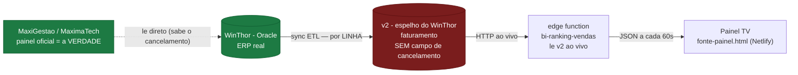

# Ranking de Vendas — Fluxo de dados e lógica

> Documento de referência do **B.I. Comercial · Ranking Diário** (painel de TV público).
> Última revisão: 29/07/2026 — validado centavo a centavo contra o **MaxiGestão (MáximaTech)**.

## 1. O que é
Painel público (`murano-bi-ranking-vendas.netlify.app`) que mostra, ao vivo, o **ranking de vendas do dia por vendedor**. Atualiza sozinho a cada 60s. Serve de "placar" para o time comercial (operação de Belém).

## 2. Cadeia de dados (de onde vêm os números)



> **Onde mora o problema:** o nó vermelho (v2) é o espelho — ele **não tem** como saber de um cancelamento que não gerou linha nova. O verde (WinThor/MaxiGestão) sabe. A recomendação da seção 6 é justamente puxar **só o cancelamento** do verde para tapar o buraco do vermelho.

```
WinThor (Oracle, ERP real)  ──►  v2 (espelho)  ──►  edge function bi-ranking-vendas  ──►  painel (Netlify)
        ▲ o MaxiGestão lê AQUI (a verdade)
```

- **Fonte real:** WinThor (ERP Oracle). É o que o MaxiGestão consulta.
- **v2:** um **espelho** do WinThor (tabela `faturamento`), sincronizado por ETL. Acesso simples (Supabase, chave de leitura pública).
- **Nosso ranking:** a edge function **`bi-ranking-vendas`** (no projeto `murano-conversas`, pública, `verify_jwt=false`) lê o **v2 AO VIVO** por HTTP/PostgREST a cada chamada. **Não há espelho intermediário nosso** para o ranking (os `wth_*` são só do Inside Sales/Relatórios).
- **Painel:** só consome o JSON da edge function.

### Tabelas envolvidas
| Onde | Tabela | Papel |
|---|---|---|
| v2 | `faturamento` | **fonte** — linhas de pedido (lida ao vivo). Colunas: `id, pedido, vlr_atendido, nome_usuario, codcli, posicao, tipo, codfilial, data_emissao` |
| murano-conversas | `bi_config` | chave de leitura do v2 (`v2_anon_key`) + meta do dia (`meta_dia`) |
| murano-conversas | `bi_cancelados_dia` | pedidos a **subtrair** (cancelamentos confirmados que a v2 não reflete) |
| murano-conversas | `bi_pedidos_dia` | espelho dos pedidos que **entraram** no ranking (auditoria) |
| murano-conversas | `bi_ranking_snapshots` | "foto" a cada ~10 min (para ver dias anteriores) |

## 3. A lógica (roteiro da edge function)
1. Lê do v2 todas as linhas de `faturamento` **emitidas hoje** (`data_emissao`, fuso **Belém −3**), com **`tipo = VENDA`** e **`codfilial ≠ 3`** (filial 3 = Maranhão, fora). Paginado 1000/página.
2. **Dedup por pedido:** fica a linha de **`max(id)`** (status atual). Mantém só **posições ativas: `L`, `B`, `M`, `F`, `P`**.
3. Subtrai os pedidos em **`bi_cancelados_dia`**.
4. **(3b) Remove fantasmas de reemissão:** pedido **não-faturado** com um **gêmeo faturado** (mesmo `codcli` + mesmo `vlr_atendido`, número maior) é descartado.
5. Agrupa por **`nome_usuario`** (quem lançou): soma `vlr_atendido`, conta pedidos, `codcli` distintos = clientes. Ordena desc.
6. Grava `bi_pedidos_dia` + snapshot; devolve JSON (totais + ranking + meta).

## 4. A regra correta (mapeada contra o MaxiGestão)
O oficial soma, por vendedor, **todos os pedidos do dia que NÃO foram cancelados**:

- ✅ **Faturado** conta.
- ✅ **Bloqueado (B)** **CONTA** — trava de crédito, mas é venda. *(Erro corrigido em 29/07: eu havia removido o B por engano na v6; revertido na v7.)*
- ✅ **Liberado / Montado / Pendente** contam.
- ❌ **Cancelado** não conta.
- ❌ **Bonificação** fora (filtro `tipo=VENDA`); **Devolução** não é subtraída (bate com "Devoluções R$ 0,00" no painel oficial).
- Valor = `vlr_atendido`; vendedor = `nome_usuario`; filial 3 fora.

Validação 29/07/2026 — os 9 vendedores internos bateram **centavo a centavo** (Thamires 5.689,45 · Milene 5.363,62 · Anne 5.178,63 · Francisco 2.847,15 · Luana 1.890,87 · Thiago 1.270,98 · Romulo 1.160,97 · Kamilly 590,47 · Administrativo 63,00).

## 5. A única fragilidade: cancelamento
A tabela `faturamento` da v2 **não tem campo de cancelamento**. O sync WinThor→v2 é **baseado em linhas**:

- **Reemissão / mudança de status** gera **linha nova** → a v2 atualiza → **auto-corrige** (ex.: Luana e Thamires em 29/07, que bateram sozinhas em minutos).
- **Cancelamento "puro"** de nota já faturada (sem reemissão) **não gera linha nova** e não tem coluna de status → a linha `F - Faturado` **fica presa** na v2 e nós continuamos contando (ex.: nota 46926 da Maiara). Esses casos raros exigem marcação **manual** em `bi_cancelados_dia`.

### Divergências e como tratar
| Sintoma | Causa | Correção |
|---|---|---|
| Vendedor com valor **a mais** que sobe/desce | reemissão/cancelamento que o v2 ainda vai sincronizar | **auto-corrige** — esperar o sync |
| Vendedor com valor **a mais** fixo (nota cancelada presa como Faturada) | cancelamento puro sem nova linha | marcar o pedido em `bi_cancelados_dia` |
| Pedido Bloqueado somando errado | — | Bloqueado **deve** contar (não excluir) |

## 6. Solução definitiva (recomendada)
Não trocar a v2 pelo WinThor (Oracle direto é complexo/arriscado para uma função pública). Em vez disso, **fechar só o buraco do cancelamento**: usar a **API Oracle do ERP** (credenciais `API_USUARIO/API_SENHA` já existem no ambiente do v2) para puxar, 1×/dia ou 1×/hora, a **lista de notas canceladas** e alimentar automaticamente o `bi_cancelados_dia`. Isso elimina o último caso manual mantendo a simplicidade da leitura via v2.
